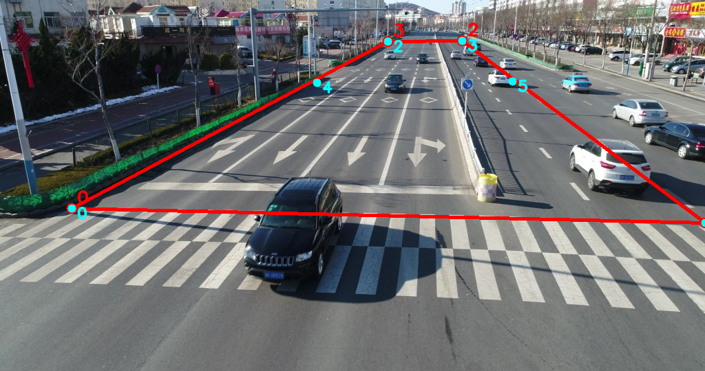
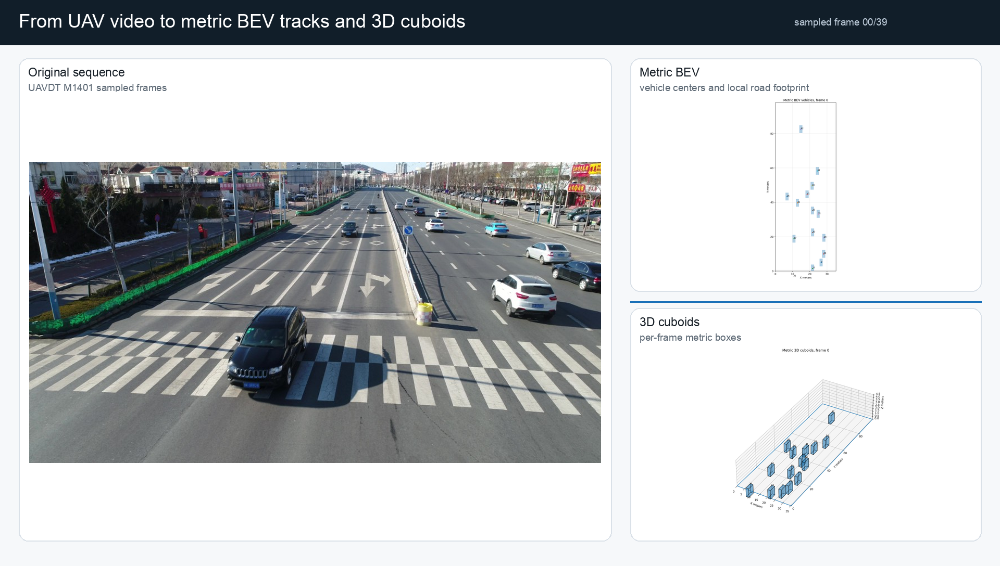
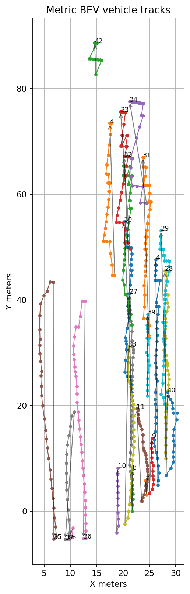
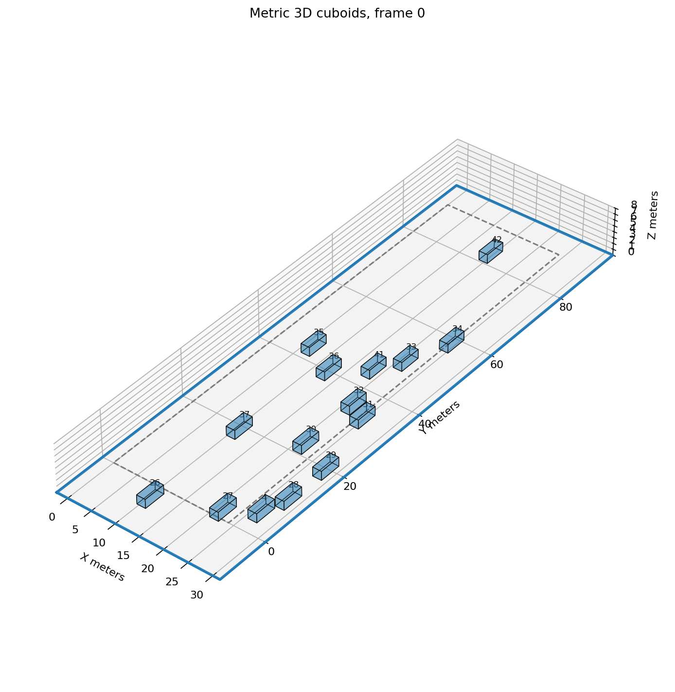
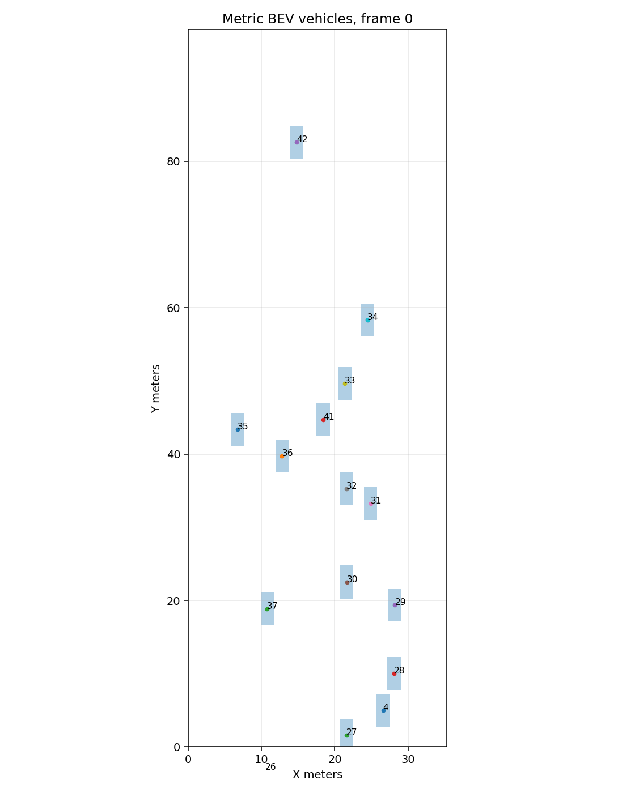
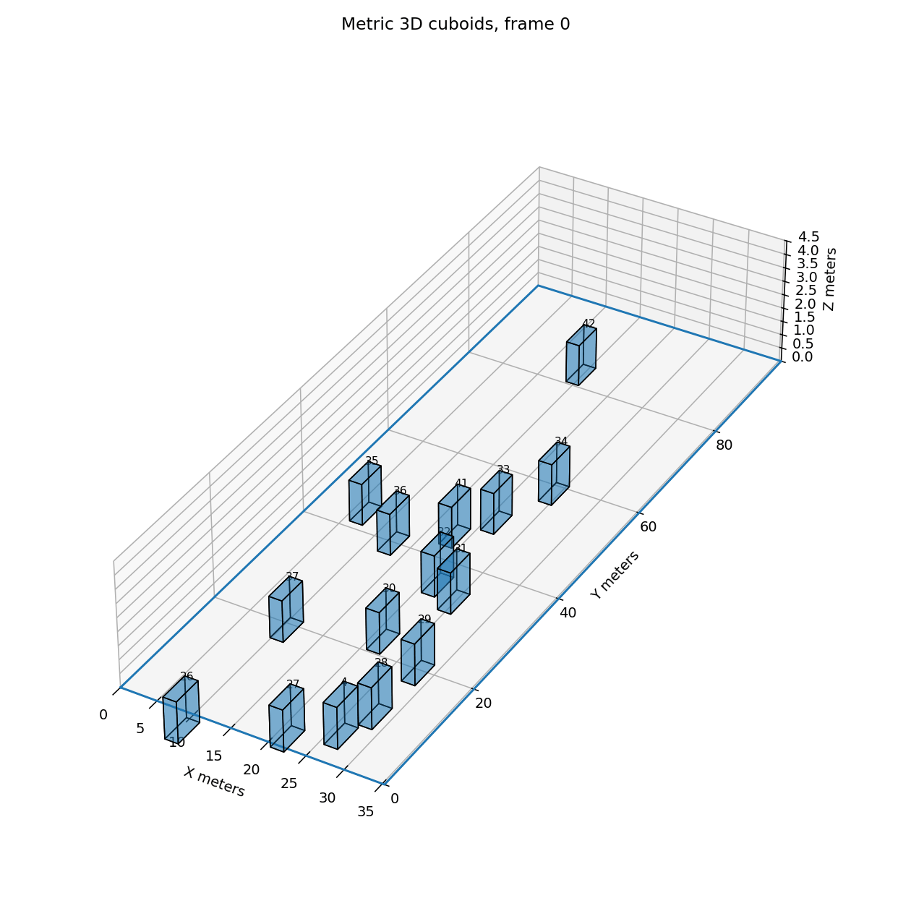

# UAVDT BEV + Lightweight 3D Scene Reconstruction

This project builds a fast, compute-efficient approximation of a dynamic 3D road scene from UAV/drone traffic video.

The core idea is **not** to reconstruct every moving vehicle with NeRF or 3D Gaussian Splatting. Instead, we use a perception-style pipeline:

```text
UAV video frames
→ vehicle annotations / detections
→ image-to-ground homography
→ BEV vehicle tracks
→ metric coordinates
→ simple 3D cuboids / scene export
```

This is closer to autonomous-driving BEV perception than photogrammetric 3D reconstruction. The output is a **semantic-geometric 3D scene**: a road plane plus tracked vehicle cuboids with approximate position, size, heading, and motion.

---

## Current Results

Current local demo run:

```text
Sequence:        UAVDT M1401
Source frames:   img000001 .. img000196
Sampling step:   5
Rendered frames: 40
Tracks:          23
Cuboid records:  632
Road plane:      24 m × 90 m
```

### Road-Geometry Calibration

The mobile-camera calibration is defined from visible road geometry. Red points are active road-plane correspondences; cyan points are visual checks.



### Original, BEV, and 3D Cuboid Demo

The strongest demo view is the synchronized triptych: original UAV frame, metric BEV view, and dynamic 3D cuboid scene.



Video outputs:

- [Original vs 3D cuboids MP4](docs/videos/demo_original_vs_3d_cuboids.mp4)
- [Original + BEV + 3D triptych MP4](docs/videos/demo_original_bev_3d_triptych.mp4)

### Metric BEV Tracks

Vehicle tracks are projected from oblique image coordinates into a local metric road-plane coordinate system.



### Dynamic 3D Cuboids

The 3D output is a lightweight traffic-state representation, not a photorealistic reconstruction.



Animation previews:





---

## Motivation

UAVDT-style drone videos contain moving cars observed from an oblique aerial viewpoint. Standard 3D reconstruction methods such as SfM, NeRF, or 3D Gaussian Splatting assume a mostly static scene. Moving cars violate that assumption and often produce ghosts, blur, or unstable geometry.

For traffic scenes, a better representation is:

```text
Static environment:
  road plane / BEV map / optional background reconstruction

Dynamic vehicles:
  tracked 3D boxes or lightweight CAD-like shapes
```

This project therefore prioritizes:

- speed,
- low compute cost,
- interpretable geometry,
- track consistency,
- compatibility with UAVDT annotations.

---

## Dataset

The current notebooks are designed around the UAVDT `M1401` sequence.

Expected image folder:

```text
/content/drive/MyDrive/UAV_benchmark_M/M1401
```

Expected ground-truth annotation file:

```text
/content/drive/MyDrive/UAV-benchmark-MOTD_v1.0/GT/M1401_gt_whole.txt
```

The recommended annotation file is:

```text
GT/M1401_gt_whole.txt
```

because it contains bounding boxes, stable target IDs, and object categories.

The format is:

```text
frame_index, target_id, bbox_left, bbox_top, bbox_width, bbox_height,
out-of-view, occlusion, object_category
```

where typical object categories are:

```text
1 = car
2 = truck
3 = bus
```

---

## Project Directory Layout

The notebooks use Google Drive as persistent storage:

```text
/content/drive/MyDrive/uav_bev_project/
  indexes/
  work/
    M1401_sample/
      images/
      frame_mapping_true.csv
    notebook_02_bev_homography/
    notebook_02b_visual_metric_homography/
    notebook_03_bev_vehicles/
    notebook_03a_gt_annotations_bev_tracks/
    notebook_04_metric_scene_export/
    notebook_05_dynamic_scene_visualization/
    notebook_06_validation/
```

---

## Notebook Overview

### Notebook 01 — Dataset Access and Drive Preparation

Purpose:

- Mount Google Drive.
- Locate UAVDT image folders.
- Create a sampled working set from `M1401`.
- Build image manifests.
- Save sample frames under the project folder.

Important output:

```text
/content/drive/MyDrive/uav_bev_project/work/M1401_sample/images/
```

Important note:

The mapping between sampled frames and original UAVDT frames is critical. If this mapping is wrong, annotation boxes will drift or move at the wrong speed.

Recommended mapping file:

```text
/content/drive/MyDrive/uav_bev_project/work/M1401_sample/frame_mapping_true.csv
```

---

### Notebook 02 — Automatic BEV Homography Prototype

Purpose:

- Estimate an approximate road homography automatically.
- Detect road/lane-like lines.
- Estimate a vanishing point.
- Create an initial BEV preview.

This notebook is useful for prototyping, but the automatic homography is heuristic and may not be geometrically accurate enough for metric 3D reconstruction.

Important output:

```text
/content/drive/MyDrive/uav_bev_project/work/notebook_02_bev_homography/*homography*.json
```

Limitations:

- The road quadrilateral is approximate.
- The BEV may still appear perspective-distorted.
- Cars and vertical objects will be distorted because a homography only rectifies the road plane.

---

### Notebook 02B — Visual Metric Homography Calibration

Purpose:

- Calibrate an image-to-ground-plane homography more accurately.
- Let the user define/edit road-plane calibration points.
- Map image pixels directly to metric ground coordinates.
- Preview the metric BEV image with a grid.
- Reproject the metric grid back onto the original image for validation.

Important output:

```text
/content/drive/MyDrive/uav_bev_project/work/notebook_02b_visual_metric_homography/metric_homography_calibration.json
```

Recommended calibration strategy:

- Calibrate one carriageway first, not the whole road.
- Use lane markings and lane boundaries.
- Use points on the flat road plane only.
- Do not use cars, poles, signs, curbs, median walls, shadows, or buildings.
- Use 8–12 point correspondences when possible.

A good calibration should make:

```text
lane markings → mostly parallel in BEV
lane widths   → approximately constant
crosswalks    → roughly perpendicular to road direction
```

Important caveat:

Cars will still look distorted in the BEV texture because they are 3D objects above the road plane. For cars, use the projected ground point from the bounding box, then place synthetic cuboids.

---

### Notebook 03 — YOLO Detections to BEV Tracks

Purpose:

- Run YOLO vehicle detection.
- Project detections to BEV.
- Create simple nearest-neighbor tracks.

This notebook was useful for early experiments, but the tracker is fragile and can produce ID switches. It is not recommended when UAVDT ground-truth annotations are available.

Known issue:

```text
The same real car may receive multiple track IDs.
```

Use Notebook 03A instead when possible.

---

### Notebook 03A — UAVDT GT Annotations to BEV Tracks

Purpose:

- Load `M1401_gt_whole.txt`.
- Use UAVDT `target_id` as the real `track_id`.
- Map sampled frames to original frame indices.
- Project annotated bounding boxes into BEV / ground-plane coordinates.
- Save GT-based BEV tracks.
- Render side-by-side validation video.

Important input:

```text
/content/drive/MyDrive/UAV-benchmark-MOTD_v1.0/GT/M1401_gt_whole.txt
```

Important output:

```text
/content/drive/MyDrive/uav_bev_project/work/notebook_03a_gt_annotations_bev_tracks/vehicle_tracks_bev.csv
```

Critical frame-mapping note:

Do not rely only on guessed parameters such as:

```python
START_FRAME_INDEX = 1
FRAME_STEP = 10
```

Verify the true mapping between sampled images and original frames. In one debug case, the real mapping was:

```text
frame_00000.jpg → img000001.jpg
frame_00001.jpg → img000006.jpg
frame_00002.jpg → img000011.jpg
```

so the correct step was `5`, not `10`.

If annotations move faster or slower than vehicles in the validation video, check the sample-to-original mapping first.

---

### Notebook 04 — Metric Calibration and 3D Scene Export

Purpose:

- Load BEV/ground-plane tracks.
- Convert positions to metric coordinates.
- Estimate yaw and speed.
- Create 3D vehicle cuboids.
- Export metric tracks, cuboids, OBJ, and dynamic scene JSON.

Important input for GT-based flow:

```text
/content/drive/MyDrive/uav_bev_project/work/notebook_03a_gt_annotations_bev_tracks/vehicle_tracks_bev.csv
```

Important outputs:

```text
/content/drive/MyDrive/uav_bev_project/work/notebook_04_metric_scene_export/vehicle_tracks_metric.csv
/content/drive/MyDrive/uav_bev_project/work/notebook_04_metric_scene_export/vehicle_cuboids_metric.csv
/content/drive/MyDrive/uav_bev_project/work/notebook_04_metric_scene_export/dynamic_metric_scene.json
/content/drive/MyDrive/uav_bev_project/work/notebook_04_metric_scene_export/scene_frame_*.obj
```

The GT-compatible v2 notebook should be used after Notebook 03A.

---

### Notebook 05 — Dynamic BEV and 3D Visualization

Purpose:

- Load metric tracks and cuboids.
- Render BEV animations.
- Render moving 3D cuboids.
- Export MP4/GIF/HTML visualizations.
- Package the dynamic scene as JSON.

Important outputs:

```text
/content/drive/MyDrive/uav_bev_project/work/notebook_05_dynamic_scene_visualization/metric_bev_animation.gif
/content/drive/MyDrive/uav_bev_project/work/notebook_05_dynamic_scene_visualization/metric_3d_cuboids_animation.gif
/content/drive/MyDrive/uav_bev_project/work/notebook_05_dynamic_scene_visualization/scene3d_cuboids_video.mp4
/content/drive/MyDrive/uav_bev_project/work/notebook_05_dynamic_scene_visualization/dynamic_scene_package.json
```

Plotly HTML output is interactive for inspection, while Matplotlib/ImageIO output is better for saving video frames and MP4 files.

---

### Notebook 06 — Validation: Frames, Detections, BEV, Tracks

Purpose:

- Validate the entire 2D-to-BEV-to-track pipeline.
- Show original frames with boxes and track IDs.
- Show BEV projections with the same IDs.
- Render side-by-side diagnostic videos.
- Detect likely ID switches, mapping errors, or projection errors.

Important output:

```text
/content/drive/MyDrive/uav_bev_project/work/notebook_06_validation/validation_original_vs_bev.mp4
```

Use this notebook whenever trajectories look plausible but do not correspond to real cars.

Diagnostic interpretation:

```text
IDs jump between cars in original view:
  tracking issue

Boxes move faster/slower than cars:
  frame mapping issue

Boxes are correct in original view but misplaced in BEV:
  homography / ground-point issue

Original + BEV are correct but 3D cuboids are wrong:
  cuboid rendering/export issue
```

---

## Recommended Pipeline

For the current best workflow, use:

```text
Notebook 01
→ Notebook 02B
→ Notebook 03A
→ Notebook 04 v2 GT
→ Notebook 05
→ Notebook 06 for validation
```

The original Notebook 02 and Notebook 03 are useful prototypes, but the improved GT-based pipeline is more reliable.

---

## Key Concepts

### Homography

A homography maps points on one plane from image coordinates to another coordinate system. In this project, it maps the road plane from image pixels to metric ground coordinates.

A homography can correct perspective only for points on the same plane. It does not correctly rectify cars, signs, poles, buildings, or other vertical objects.

### BEV

BEV means bird’s-eye view. Here, it means a top-down coordinate system over the road plane.

### Vehicle Ground Point

For each 2D vehicle bounding box, we estimate a point on the road plane. A common first approximation is:

```python
u = (x1 + x2) / 2
v = y2
```

This is the bottom-center of the bounding box. For oblique UAV views, this can be imperfect. Alternatives include:

```python
v = y1 + 0.75 * (y2 - y1)
```

or using segmentation/vehicle footprint estimation.

### Cuboid Model

Each vehicle is represented as a simple 3D cuboid:

```text
center = (x_m, y_m, height / 2)
size   = (length, width, height)
yaw    = direction of motion or lane direction
```

Typical dimensions:

```text
car:   4.5 m × 1.8 m × 1.5 m
truck: 8.0 m × 2.5 m × 3.0 m
bus:   12.0 m × 2.6 m × 3.2 m
```

---

## Known Limitations

- The road is assumed to be approximately planar.
- Vehicle cuboids are approximate, not detailed meshes.
- Metric scale depends on calibration quality.
- Homography quality depends strongly on calibration point placement.
- A road-plane homography cannot reconstruct vertical geometry.
- Occluded or partially visible cars may have inaccurate ground points.
- The automatic homography prototype is not accurate enough for all scenes.

---

## Common Failure Modes and Fixes

### Bounding boxes drift ahead of cars

Cause:

```text
Wrong sample-frame to original-frame mapping.
```

Fix:

- Build `frame_mapping_true.csv` using image hashes or a saved copy manifest.
- Join annotations by actual `original_frame_index`, not guessed `FRAME_STEP`.

---

### Same car has multiple IDs

Cause:

```text
YOLO + simple nearest-neighbor tracking produced ID switches.
```

Fix:

- Use UAVDT `target_id` from `M1401_gt_whole.txt`.
- Or use a stronger tracker such as ByteTrack / BoT-SORT.

---

### Cars cluster on one side of the 3D scene

Cause:

```text
Bad or overly rough homography.
```

Fix:

- Use Notebook 02B.
- Calibrate with lane-line points on the road plane.
- Check the reprojected metric grid on the original image.

---

### BEV image still looks perspective-distorted

Cause:

```text
Calibration points do not match real metric coordinates, or include non-road points.
```

Fix:

- Use 8–12 lane-boundary correspondences.
- Calibrate one carriageway first.
- Avoid cars, curbs, poles, shadows, and median walls.

---

### Cars look stretched in BEV texture

Cause:

```text
Cars are 3D objects above the road plane.
```

Fix:

- Ignore the warped visual car appearance.
- Use the road-plane projected ground point and render synthetic cuboids.

---

## Environment

The notebooks are designed for Google Colab.

Typical dependencies:

```python
opencv-python
numpy
pandas
matplotlib
imageio
plotly
ultralytics  # only for YOLO prototype notebook
```

Google Drive is used for persistent input/output.

---

## Current Status

Completed:

- Dataset/sample preparation.
- Automatic homography prototype.
- Visual metric homography calibration notebook.
- YOLO prototype.
- GT-annotation BEV tracking path.
- Metric cuboid export.
- Dynamic 3D visualization.
- Validation notebook.

Current priority:

```text
Polish the research-paper narrative and extend experiments beyond the current M1401 demonstration.
```

The current M1401 result already produces calibrated BEV tracks, metric cuboids, GIF animations, MP4 demo videos, and a draft research-paper PDF.

---

## Planned Next Steps

1. Finalize Notebook 02B calibration using lane-line correspondences.
2. Update Notebook 03A to consume `metric_homography_calibration.json` directly.
3. Update Notebook 04 to skip pixel-to-meter calibration when metric ground coordinates are already available.
4. Add automatic or semi-automatic lane-based homography scoring.
5. Add optional CAD mesh replacement for cuboids.
6. Export the dynamic scene to formats useful for simulation or visualization, such as glTF or USD.
